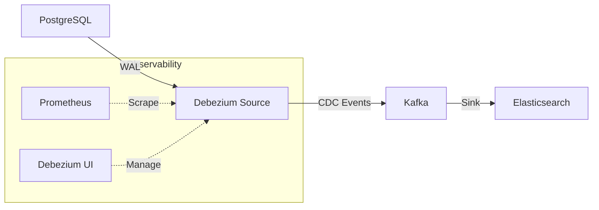

# Real-time CDC Pipeline with Debezium, Kafka, & Elasticsearch

A production-ready Change Data Capture (CDC) pipeline that streams real-time data changes from **PostgreSQL** to **Elasticsearch** via **Kafka** using **Debezium**.

## 🏗 Architecture



## 🚀 Quick Start

### Prerequisites
- Docker & Docker Compose

### 1. Start Infrastructure
```bash
docker-compose up -d
```
> **Note**: The database `test_cdc` is automatically initialized with the schema (`order_equipment_detail`, `equipment`, `product`) via `database/init_schema.sql`.

### 2. Deploy Debezium Source Connector
Once the services are up (wait ~30-60s), deploy the Debezium PostgreSQL source connector:

```bash
bash scripts/create_connector.sh
```

### 3. Deploy Elasticsearch Sink Connector
Stream CDC events from Kafka to Elasticsearch:

```bash
bash scripts/setup_es_connector.sh
```

### 4. Verify Connectors
```bash
curl -s http://localhost:8083/connectors | jq .
```

## 📂 Project Structure

| Path | Description |
|------|-------------|
| `docker-compose.yml` | Main infrastructure (Zookeeper, Kafka, Connect, Postgres, ES, Prometheus). |
| `database/init_schema.sql` | Database schema (`order_equipment_detail`, `equipment`, `product`). |
| `scripts/create_connector.sh` | Deploys the Debezium PostgreSQL source connector. |
| `scripts/setup_es_connector.sh` | Deploys the Elasticsearch sink connector. |
| `configs/es-sink-connector.json` | Elasticsearch sink connector configuration. |
| `conf/` | Prometheus JMX exporter and metrics configuration. |

## 📊 Monitoring & Observability

- **Debezium UI**: [http://localhost:8088](http://localhost:8088) — Manage and monitor connectors.
- **Prometheus**: [http://localhost:9001](http://localhost:9001) — Kafka Connect metrics.
- **Elasticsearch**: [http://localhost:9200](http://localhost:9200) — Query indexed CDC data.

## 🛠 Troubleshooting

**View Connector Logs**
```bash
docker logs jdbc-source-connect -f
```

**Check Kafka Topics**
```bash
# List all topics
docker exec broker kafka-topics --bootstrap-server broker:9092 --list
```
