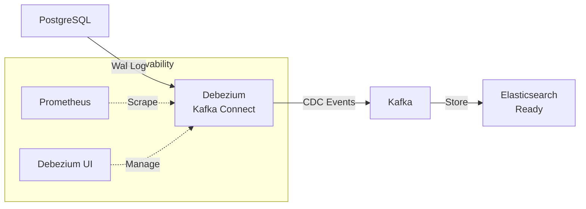

# Real-time CDC Pipeline with Debezium, Kafka, & Elasticsearch

A production-ready Change Data Capture (CDC) pipeline that streams real-time data changes from **PostgreSQL** to **Kafka** using **Debezium**, with infrastructure ready for **Elasticsearch** indexing.

## 🏗 Architecture



## 🚀 Quick Start

### Prerequisites
- Docker & Docker Compose

### 1. Start Infrastructure
```bash
docker-compose up -d
```
> **Note**: The database `test_cdc` is automatically initialized with the schema (`order_equipment_detail`, `equipment`, `product`) via `database/init_schema.sql`.

### 2. Deploy CDC Connector
Once the services are up (wait ~30-60s), deploy the Debezium source connector:

```bash
bash scripts/create_connector.sh
```

### 3. Verify Pipeline
Check the connector status:
```bash
curl -s http://localhost:8083/connectors/local-cdc-with-test-database/status
```

## 📂 Project Structure

| Path | Description |
|------|-------------|
| `docker-compose.yml` | Main infrastructure (Zookeeper, Kafka, Connect, Postgres, ES, Prometheus). |
| `database/init_schema.sql` | Active database schema definitions. |
| `scripts/` | `create_connector.sh`: Deploys the Debezium Postgres connector.<br>`update_connector.sh`: Commands to update connector config. |
| `conf/` | Configuration for Prometheus JMX exporter and metrics. |
| `connect.Dockerfile` | Custom image build with Debezium and JMX exporter. |

## 📊 Monitoring & Observability

- **Debezium UI**: [http://localhost:8088](http://localhost:8088) - Graphical interface to view and manage connectors.
- **Prometheus**: [http://localhost:9001](http://localhost:9001) - metrics scraping from Kafka Connect.
- **Elasticsearch**: [http://localhost:9200](http://localhost:9200) - Data storage (Sink connector setup required).

## 🛠 Troubleshooting

**View Connector Logs**
```bash
docker logs jdbc-source-connect -f
```

**Check Kafka Topics**
```bash
# List all topics
docker exec broker kafka-topics --bootstrap-server broker:9092 --list
```
